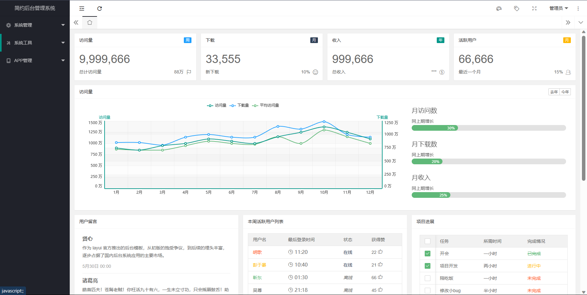
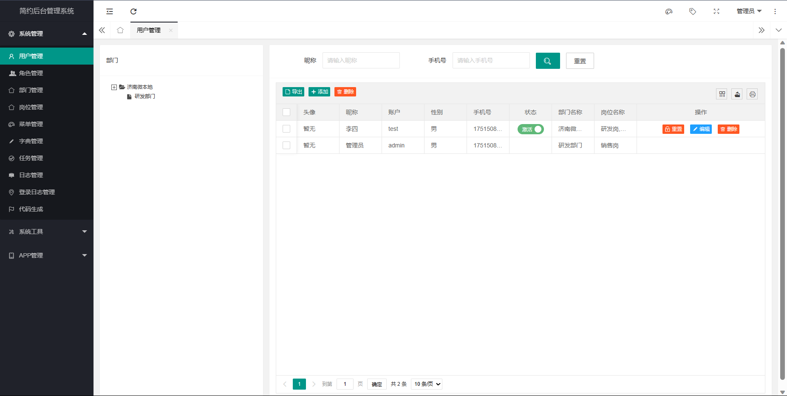
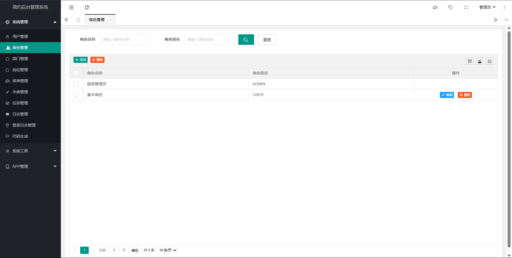

简约后台管理系统
=================

## 项目介绍

本项目是一个基于Spring Boot和Layui的后台管理系统，提供了基础的权限管理、代码生成、任务调度等功能模块。系统采用现代化的前后端分离架构设计，使用MyBatis Plus作为ORM框架，整合了Swagger2作为API文档工具，并通过Redis实现缓存管理。

## 联系我们

如需技术支持或合作，请联系：
- 邮箱：yangyouwang@example.com
- QQ：123456789
- 微信：yangyouwang1990

## 软件架构

- **后端技术栈**：
  - Spring Boot 2.x
  - MyBatis Plus
  - Redis
  - Quartz
  - Spring Security
  - Swagger2
  - LayuiAdmin

- **前端技术栈**：
  - Layui
  - jQuery
  - HTML5/CSS3

- **数据库**：
  - MySQL
  - Redis（缓存）

## 环境需求

- JDK 1.8+
- Maven 3.5+
- MySQL 5.7+
- Redis 3.0+
- Node.js（可选，前端构建）

## 项目搭建

### 后端部署

1. 克隆项目：
   ```bash
   git clone https://gitee.com/yangyouwang/crud.git
   ```

2. 修改配置文件：
   ```bash
   cd crud/src/main/resources
   vi application-dev.yml # 修改数据库、Redis等配置
   ```

3. 构建并运行：
   ```bash
   mvn clean package
   java -jar target/crud.jar
   ```

### 前端部署

1. 静态资源已内置，无需额外部署
2. 如需修改前端资源，可编辑`src/main/resources/static/layuiadmin`目录下的文件

## 使用说明

### 功能模块

- **用户管理**：支持用户增删改查、角色分配、密码重置等功能
- **角色权限**：基于Spring Security的RBAC权限模型
- **菜单管理**：动态菜单配置，支持多级菜单
- **部门管理**：树形结构部门管理
- **岗位管理**
- **任务调度**：集成Quartz定时任务
- **日志管理**：操作日志、登录日志记录
- **代码生成**：支持根据数据库表自动生成CRUD代码

### 接口文档

访问 `/swagger-ui.html` 查看API文档

### 多环境配置

支持多环境配置：
- application-dev.yml（开发环境）
- application-test.yml（测试环境）
- application-prod.yml（生产环境）

## 部分截图



